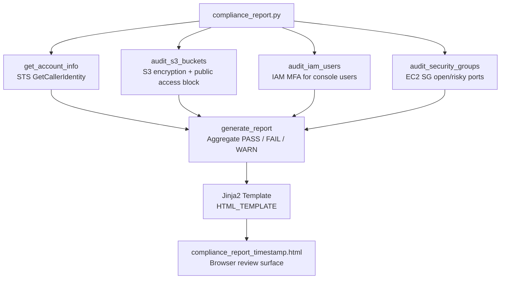

# Compliance Report

One Python script that runs three boto3 audits (S3 encryption and public-access block, IAM MFA for console users, EC2 security-group inbound rules) and writes a timestamped HTML file with PASS / FAIL / WARN counts. I built this after writing the per-resource audits separately and getting tired of opening three terminals to answer one question: what is wrong in this account right now?

It does not collect CloudTrail events, export PDF, or emit OSCAL. Those are listed under Future Enhancements. What ships is the HTML report.

## Compliance Controls Addressed

| NIST 800-53 Rev 5 | FedRAMP High | CJIS v6.0 | Validation Method |
|--------------------|:------------:|:---------:|-------------------|
| CA-2 Control Assessments | Yes | | The HTML report is the control-assessment artifact |
| CA-7 Continuous Monitoring | Yes | Continuous monitoring expected | Regular generation supports ongoing control assessment |
| AU-3 Content of Audit Records | Yes | | Report includes timestamp, account, findings, severity, status |
| AU-12 Audit Record Generation | Yes | | Every report run produces a structured, dated artifact |
| PM-31 Continuous Monitoring Strategy | Yes | | Report integrates with the broader monitoring approach |
| SI-4 System Monitoring | Yes | | Aggregates monitoring findings into a single review surface |

## Overview

`compliance_report.py` pulls account identity from STS, then calls three audit functions. Each function returns a list of finding dicts with a shared `status` field. `generate_report` tallies PASS / FAIL / WARN and renders an embedded Jinja2 template to `compliance_report_<timestamp>.html`.

## Architecture Overview



Editable Mermaid source (kept in sync with the fence above): [`docs/architecture.mmd`](docs/architecture.mmd).

## Requirements

- Python 3.x
- `boto3` library
- `jinja2` library
- AWS CLI configured with credentials (`aws configure`)

### Install dependencies

```bash
pip install boto3 jinja2
```

## Usage

### Generate a compliance report

```bash
python compliance_report.py
```

**Sample output:**

```
============================================================
AWS Compliance Report Generator
============================================================

[1/4] Getting account information...
      Account: 365827925154

[2/4] Auditing S3 buckets...
      Found 1 buckets

[3/4] Auditing IAM users...
      Found 1 users

[4/4] Auditing security groups...
      Found 1 security groups

Generating HTML report...

✓ Report saved: compliance_report_20260121_162513.html

Open the HTML file in a browser to view the report.
```

### View the report

Open the generated `.html` file in any web browser.

## Report Contents

### Executive Summary
- Total passed checks (green)
- Total failed checks (red)
- Total warnings (yellow)

### S3 Bucket Audit (SC-28, AC-3, AC-21)

| Check | Description |
|-------|-------------|
| Encryption | Server-side encryption enabled? |
| Public Access Block | All four settings enabled? |

### IAM User Audit (IA-2, AC-2)

| Check | Description |
|-------|-------------|
| Console Access | Does user have AWS Console login? |
| MFA Enabled | Is MFA configured for console users? |

### Security Group Audit (SC-7, CM-7)

| Check | Description |
|-------|-------------|
| Open Ports | Ports open to `0.0.0.0/0` (non-risky) |
| Risky Ports | SSH, RDP, database ports open to internet |

## Status Legend

| Status | Meaning | Color |
|--------|---------|-------|
| `PASS` | Check passed | Green |
| `FAIL` | Critical issue | Red |
| `WARN` | Review recommended | Yellow |
| `INFO` | Informational only | Blue |

## How an Auditor Uses This Output

Hand the HTML file to an assessor who wants one page instead of three CLI dumps. The summary counts are the go / no-go view; the S3, IAM, and security-group tables are where they spot-check a FAIL. Run it on a schedule and you have dated artifacts for CA-7. System owners can use the FAIL rows as the punch list for CA-5 items. It is not a POA&M tracker on its own.

## FedRAMP 20x Alignment

The useful piece for 20x-style pipelines is the stable finding shape and the never-overwriting filename. HTML is what humans read today. OSCAL Assessment Results JSON is on the Future Enhancements list so the same run can feed trestle later without a second collection pass. That JSON path is not implemented yet.

## CJIS v6.0 Relevance

CJIS v6.0 expects continuous monitoring and weekly audit-record review for systems with CJI. This report is the human-readable weekly artifact for the three resource checks it covers. Pair it with `cloudtrail-audit` for AU-6 event review and `evidence-logger` if you need a retention trail; those are separate repos. This one only writes the HTML file.

## Roadmap

Today this script calls boto3 itself. The per-resource tools (`s3-audit`, `sg-audit`, `iam-audit`) still exist as standalone CLIs. Planned next step is to stop re-implementing those checks here and instead consume a shared collector, then add OSCAL Assessment Results JSON next to the HTML for [`oscal-evidence-pipeline`](https://github.com/0xBahalaNa/oscal-evidence-pipeline). Until that lands, treat the HTML as the only shipped product.

## Future Enhancements

- Add CloudTrail findings to report (AU-6 events)
- Export to PDF
- Email report automatically (CA-7 distribution)
- Add charts / graphs with Chart.js (KSI visualization)
- Compare with previous reports (trend analysis)
- Add remediation recommendations linked to control IDs
- Emit OSCAL Assessment Results JSON alongside HTML (FedRAMP 20x; see *Roadmap*)

## Framework Reference

Control family mappings and AWS implementation details are documented in [nist-800-53-rev-5-to-aws-mapping](https://github.com/0xBahalaNa/nist-800-53-rev-5-to-aws-mapping).

## License

MIT. Full text in [LICENSE](LICENSE).
